## Relatório
Está prática foi realizada por [Mara Vitória](http://github.com/maravitoria04/) e Eu. 
Fiz todos os passos da pratica exigida pelo professor, não tive dificuldaddes, fizemos todos os passo em computadores diferentes e estavamos juntos ou seja, não houve divisão. Por ja ter brincado com o GPG não tive dificuldades mais foi bom pois não sabia realizar o passo de revogação de chaves. 
O tempo gasto foi poucos minutos, tipo de 20 a 30 minutos.
 
Os passos realizados podem ser visto na seção abaixo.
 
 
 
 
 

# Prática de GPG

## Criar Chave, Adicionar Foto e Publicar chave no Servidor
Criando Chave. 
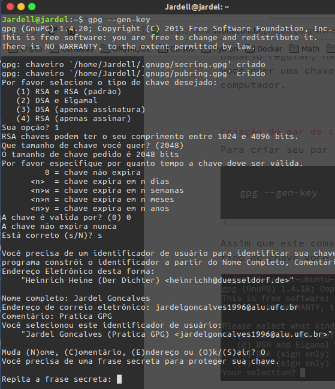
 
Adicionando Foto. 
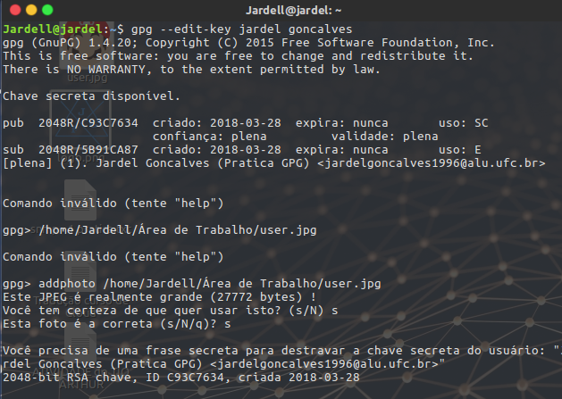
 
Listando Chaves e Publicando no Servidor. 
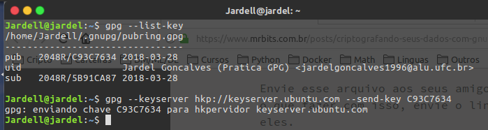

## Importar a chave de outra pessoa do servidor remoto
Importando Chave. 
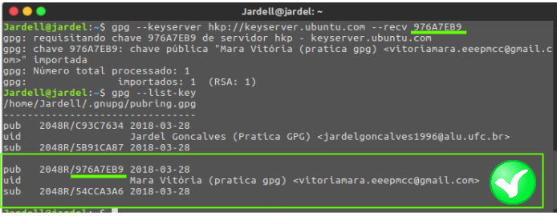

## Enviar uma mensagem assinada em texto plano
Mensagem Assinada. 
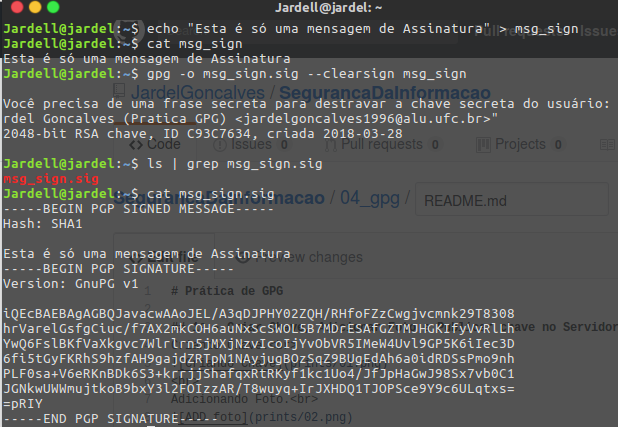
 

## Enviar um mensagem de texto criptografada em texto plano
Mensagem Criptografada. 
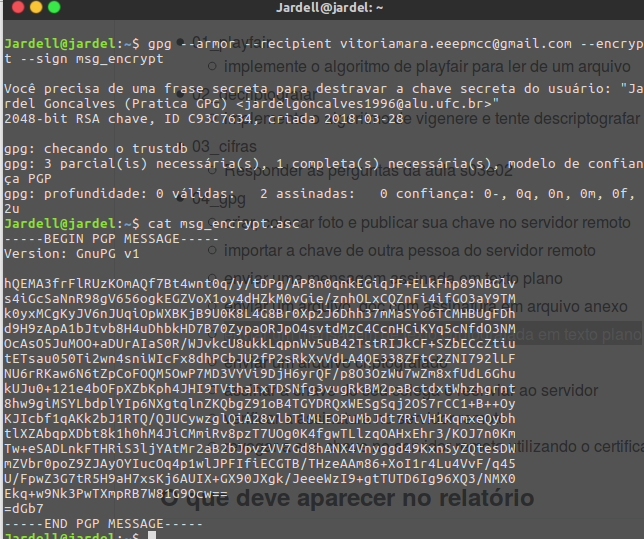

## Assinar a chave do seu colega e reenviar ao servidor
Listando Chaves. 
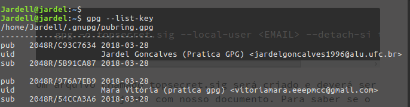
 
Assinando localmente. 
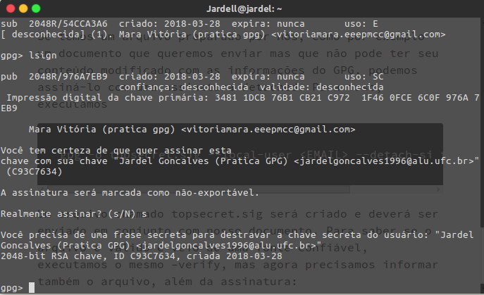
 
Assinando porem sem alterar o quanto eu confio na chave. 
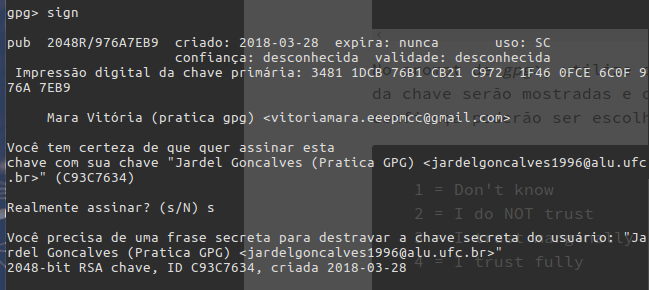
 
**OBS:** Mesmo assinando o nivel de confiança continua *desconhecida*
  
Alterando o nivel de confiança da chave. 
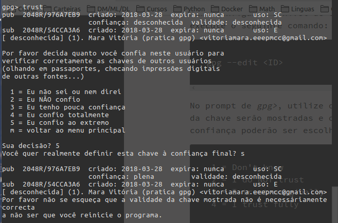
 
**OBS:** Alterei o nivel para *5*, neste caso o nivel de confiança se torna **plena**
  
Exportando para o servidor. 
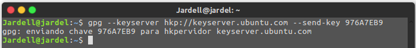

## Revogar a sua chave no servidor remoto utilizando o certificado
Gerando o certificado de revogação. 
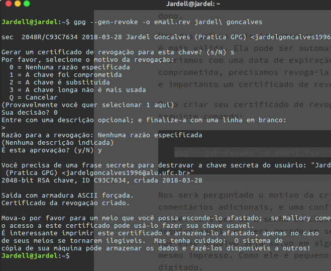
 
Revogando a chave. 
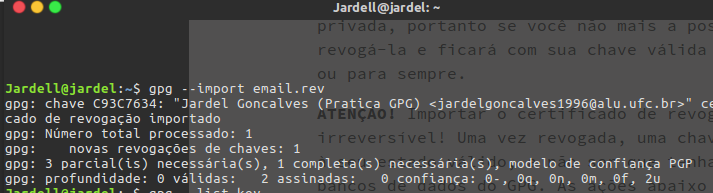
 
Exportando para o servidor. 
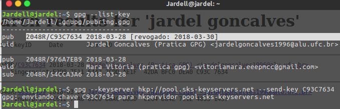
