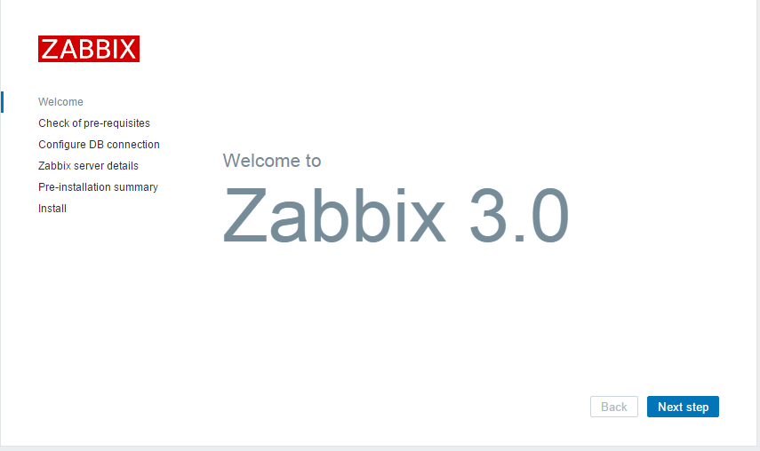
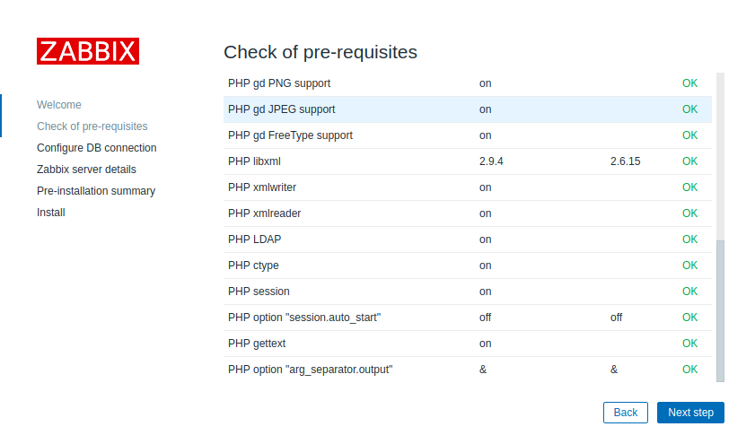
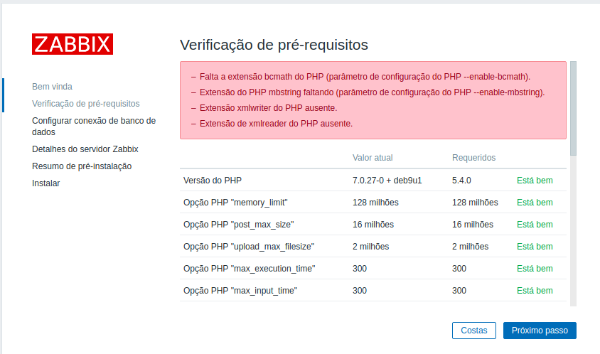
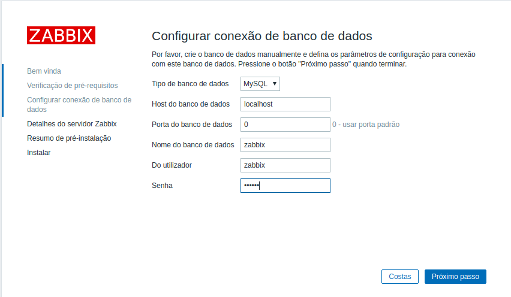
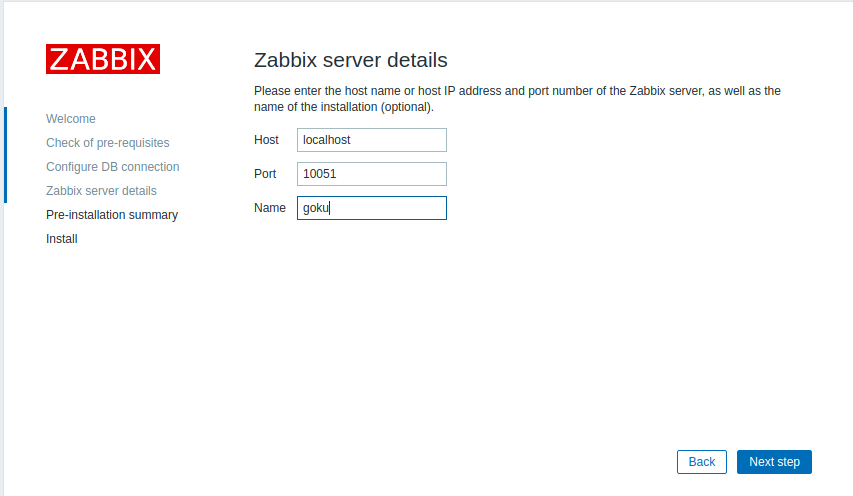
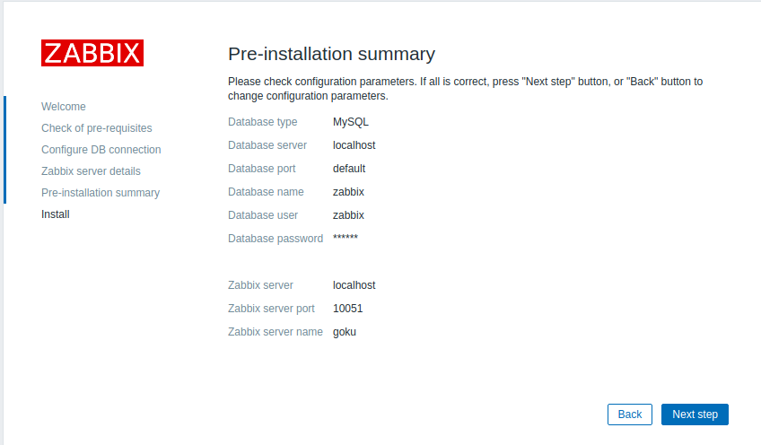
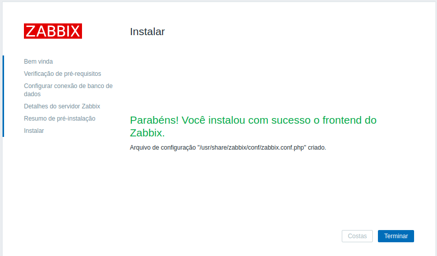
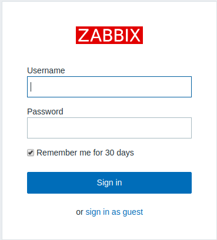

# PRÁTICA ZABBIX

## Dupla:
Jardel Gonçalves Ferreira

Mara Vitória Soares de Lima [Github](https://github.com/maravitoria04/)

## O QUE É?

Zabbix é uma ferramenta que pode ser utilizada para monitorar toda sua infraestrutura de rede, além de aplicações. É um software de código aberto criado por Alexei Vladishev, Ele é projetado para monitorar disponibilidade e desempenho dos componentes de uma infraestrutura de T.I, sendo capaz também de monitorar um número ilimitado de métricas e fornecer análises sofisticadas sobre a saúde da infraestrutura de T.I. Sendo capaz de identificar a "fonte" de um problema nos sistemas de T.I, permite aos usuários Zabbix (SysOps) agirem rapidamente, reduzindo os custos associados com a paralisação.

Pode ser proativo, percebendo problemas em tempo hábil, ele monitora todo e qualquer dispositivo da infraestrutura de T.I, monta mapas/telas que possibilitem entender/resolver problemas rapidamente, cria uma documentação viva e atualizável de toda a infraestrutura, criar visões baseadas no objetivo de quem “assistirá” o monitoramento (níveis do suporte de T.I, gerência empresarial, parceiros de negócio e etc)

O Zabbix possui um vasto número de usuários ao redor do mundo. No Brasil, existem grupos de usuários distribuídos entre a Lista de e-mails oficial, grupo no Facebook e grupo no Telegram.

### Componentes
De acordo com o [Wikipedia](https://pt.wikipedia.org/wiki/Zabbix)
+ **Zabbix Server** – Este é o centro do Software Zabbix. O servidor pode verificar remotamente os serviços de rede (como servidores web e servidores de e-mail), utilizando controles simples. Ele é o componente central para o qual os agentes reportam a disponibilidade, integridade de informações e estatísticas dos servidores. É nele que toda a configuração, estatísticas e dados operacionais são armazenados, sendo o componente que participará ativamente alertando os administradores quando surgirem problemas em qualquer um dos sistemas monitorados;
+ **Zabbix Proxy** – É uma parte opcional da implantação do Zabbix. O Proxy coleta dados de desempenho e disponibilidade, em nome do Zabbix Server. Todos os dados coletados localmente são transferidos para o Zabbix Server Proxy. O Zabbix Proxy é uma solução ideal para um controle centralizado de locais remotos, filiais, não havendo a necessidade dos administradores de redes locais;

+ **Zabbix Agent** – A fim de acompanhar ativamente recursos e aplicações locais (como discos rígidos, memória, processador, etc.) em sistemas em rede, os sistemas devem executar o Agente Zabbix. O agente vai reunir informações operacionais do sistema em que está em execução, e informar esses dados ao Zabbix para posterior processamento. Em caso de falhas (como um disco rígido estar lotado, ou um processo parar), o servidor Zabbix pode ativamente alertar os administradores da máquina que relatou o problema;

+ **Interface Web** – Permite fácil acesso aos dados de monitoração e configuração do Zabbix em qualquer lugar e em qualquer plataforma. A interface é uma parte do servidor Zabbix, e é geralmente (mas não necessariamente) executada na mesma máquina física como uma execução do servidor Zabbix.ga


## VANTAGENS
Controle total e centralizado, analise detalhada de cada dispositivo na rede, relatorio detalhado dos problemas ocorridos, melhora significativa no tempo de ação a desastre, aviso ou resolvimento automatico do problema ocorrido, open source e etc...

## INSTALAÇÕES

### SERVIDOR ZABBIX
Utilizamos uma maquina com o Debina 9

Tornando superusuário
```
su
```
Editando o arquivo sources.list
```
nano /etc/apt/sources.list
```
Deixe as sguintes configurações no arquivo:
```
deb http://ftp.br.debian.org/debian/ stretch main contrib non-free

deb http://security.debian.org/debian-security stretch/updates main non-free

deb http://ftp.br.debian.org/debian/ stretch-updates main non-free
```
Atualizando lista de repositórios
```
apt-get update
```
Baixando o pacote
```
wget http://repo.zabbix.com/zabbix/3.0/debian/pool/main/z/zabbix-release/zabbix-release_3.0-2+stretch_all.deb
```
Instalação do pacote
```
dpkg -i zabbix-release_3.0-2+stretch_all.deb
apt-get update
apt-get install zabbix-server-mysql zabbix-frontend-php zabbix-agent zabbix-get

```
Configurando Mysql
```
mysql -u root -p
create database zabbix character set utf8 collate utf8_bin;
grant all privileges on zabbix.* to zabbix@localhost identified by 'senha';
quit;
```
Criando Tabelas do banco
```
cd /usr/share/doc/zabbix-server-mysql
zcat create.sql.gz | mysql -uzabbix -p zabbix
```
Configurando o arquivo de configuração do Zabbix

Procure as linhas que, `DBHost=`, `DBName=`, `DBUser=` e `DBPassword=`
Caso estejam comentadas, descomente-as e adicione as seguintes configurações:
```
...
DBHost=localhost
...
DBName=zabbix
...
DBUser=zabbix
...
DBPassword=sua_senha
...
```
Inicie o Serviço:
```
service zabbix-server start
```

Configurando o fuso horário:
Descomente a(s) linha(s)
```
php_value date.timezone Europe/Riga
```
Altere para seu fuso horário:
```
php_value date.timezone America/Fortaleza
```
Reinicie o serviço apache2
```
service apache2 restart
```
#### *Opção de Instalação via Script:
[Acessar](https://github.com/JardelGoncalves/script-install-zabbix-debian)

Feito a instalação, vamos acessar a interface web para concluir de fato a instalação
```
http://seu_ip/zabbix/
```
#### Primeira Tela:



#### Segunda Tela:



**Possiveis Erros**



***Corrigindo erro***
```
apt-get install php-mbstring php-bcmath php-xmlwriter php-xmlreader
service apache2 restart
```
#### Terceira Tela
Preencha os dados corretamente


#### Quarta Tela
Deixe as informações padrões, apenas adicione um `nome`


#### Quinta Tela



#### Sexta Tela
Instalação concluida


#### Tela de Login
Para acessar, o zabbix define as seguintes crenciais por padrão:
`Username: Admin` e `Password: zabbix`



### MAQUINA CLIENTE (zabbix-agent)
Utilizamos uma maquina Ubuntu Server 16.04

Tornando superusuário:
```
sudo su
```

Baixando pacote:
```
wget http://repo.zabbix.com/zabbix/3.2/ubuntu/pool/main/z/zabbix-release/zabbix-release_3.2-1+xenial_all.deb
```
Instalando pacote:
```
dpkg -i zabbix-release_3.2-1+xenial_all.deb
apt-get update
apt-get install zabbix-agent
```

Configurando agent:
```
nano /etc/zabbix/zabbix_agentd.conf
```
Procure as linhas `Server=` e `ServerActive=`, caso elas estejam comentadas, descomente-as e faça a seguinte configuração:
```
Server=ip-do-servidor
...
ServerActive=ip-do-servidor
```

Verifique se o agent está rodando:
```
service zabbix-agent status
```
Caso ele esteja dê o seguinte comando:
```
service zabbix-agent restart
```
Caso contrário:
```
service zabbix-agent start
```
## Matérial de apoio
+ [Instalação e monitoramento com Zabbix](https://drive.google.com/open?id=1fNiV8GKaPLxrTnThXAKRvN8I3b1uj1_M)
+ [Teoria Zabbix](https://drive.google.com/open?id=1zW1ryKNX8E2gKPfxmY5uCoxA5cEm6A2M)
+ [Monitoring all Elements of Your Database Operations With Zabbix ](https://pt.slideshare.net/Zabbix/monitoring-all-elements-of-your-database-operations-with-zabbix?next_slideshow=1)
+ [Monitoring Solution for Everyone ](https://pt.slideshare.net/Zabbix/alexei-vladishev-zabbix-monitoring-solution-for-everyone)

## Atividade
+ [Link](https://drive.google.com/open?id=1fSqxYfn0eCBov0T-yL68HVhUFMIOgPOb)
