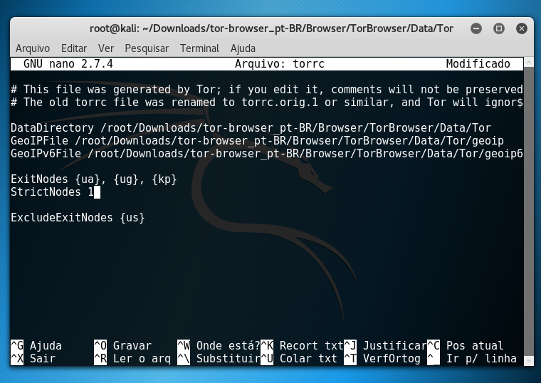
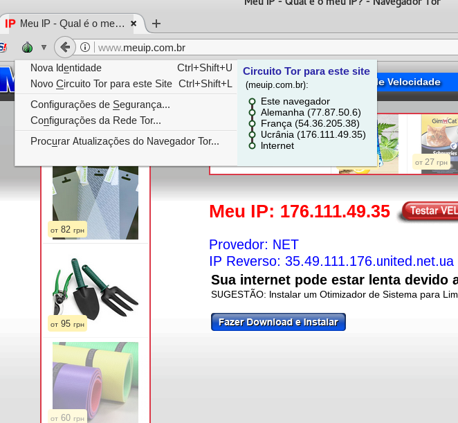
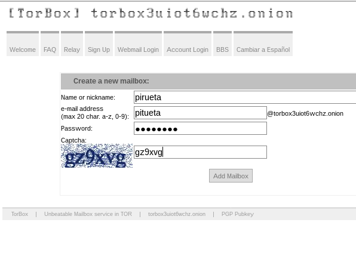
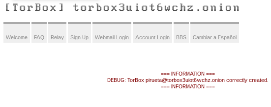
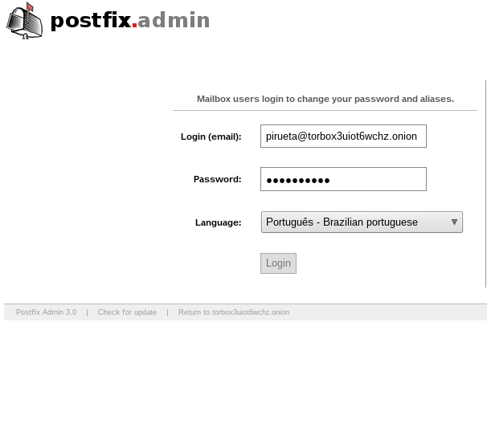
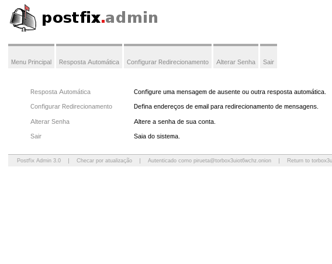

# Prática Tor

## Instalando o Tor

Baixando
```
curl -O -L https://www.torproject.org/dist/torbrowser//7.5.4/tor-browser-linux64-7.5.4_pt-BR.tar.xz
```
Descompactando
```
tar xvf tor-browser-linux64-7.5.4_pt-BR.tar.xz
```
Acessando o dirétorio gerado
```
cd tor-browser_pt-BR
```
Modificando alguns parametros para o funcionamento do Tor
```
sed -i 's/"`id -u`" -eq 0/"`id -u`" -eq x/' Browser/start-tor-browser
```
```
sed -i 's/The Tor Browser Bundle should not be run as root.  Exiting.//' Browser/start-tor-browser
```
## Configurando uma lista negra



## Acessando um site que rastreia o IP
Navegador que implementa o protocolo Tor (podemos observar a rota que a solicitação fez)

Abrindo o navegador Tor
```
./Browser/start-tor-browser 2> /dev/null &
```



Navegador que não implementa 


## Acessando um site na Deep Web
Criei um email na rede onion. Segue o site: `http://torbox3uiot6wchz.onion/`

As imagens abaixo apresenta os passos: `Criar o email`, `confirmação do precedimento de criação`, `tela de acesso` e `acessando o email`, respectivamente.








