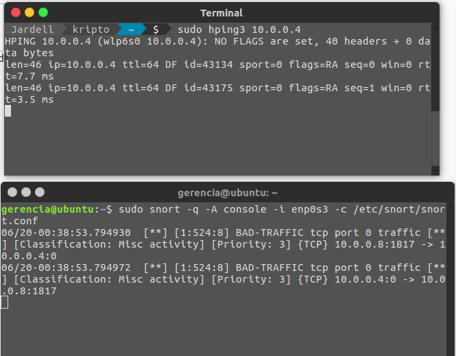

# Prática IDS

Por ser úsuario de linux, tive que buscar outras ferramentas para fazer o papel do atacante ja que a disponibilizada até o momento da realização desta prática, no caso, eu econtrei a ferramenta `hping3` que pode ser obtida no ubuntu 16.04 através do comando `sudo apt-get install hping3` com isso em mãos, realizei consegui realizar a atividade como mostrado na figura abaixo.

